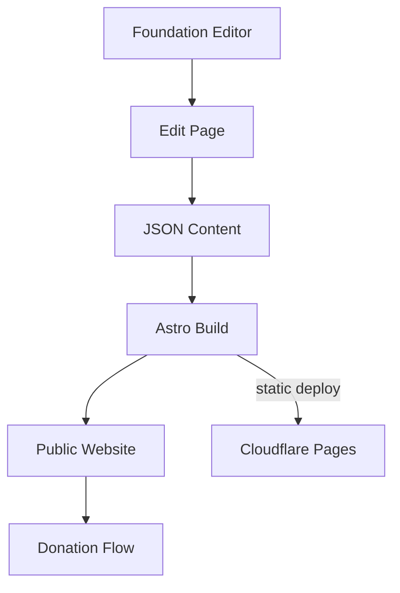

# Blueprint: savvops/dptf-foundation-astro

_Auto-generated architectural documentation — 2026-09-24 (Phase 1). Built from the repository file tree, README and manifests._

## Diagram

## How it works

This is the website for the Dr. Patience Selumun Tsavnande Foundation (drtsavnandefoundation.com), a nonprofit — built with Astro and Tailwind, deployed on Cloudflare Pages. All website content lives as JSON files in `src/content/` across ~39 folders: site settings, navigation, homepage sections, stats, core values, objectives, board members, programs, impact areas, medical outreaches, education initiatives, FAQs, donation amounts, financial and activity reports.

Content management is deliberately zero-cost: an `/edit` page on the live site gives non-technical editors a form-based way to update the JSON, which commits through GitHub and triggers a rebuild. No CMS subscription, no database. Images sit in `public/images/`; PDF reports (financial, activity) are served as static files for the transparency pages.

## Key files

- `src/content/` — all site content as JSON (~39 collections)
- `public/images/` — site imagery
- Financial/activity report PDFs — transparency documents
- `astro.config.mjs` — Astro + Tailwind config

## For the owner

The foundation's public face: mission, programs, impact stories, donation flows, and transparency reports — all editable through a simple web form by anyone on the team, with zero software cost. It follows the same proven pattern as your other Astro sites: content as files in git, static hosting on Cloudflare, rebuild on every change.
